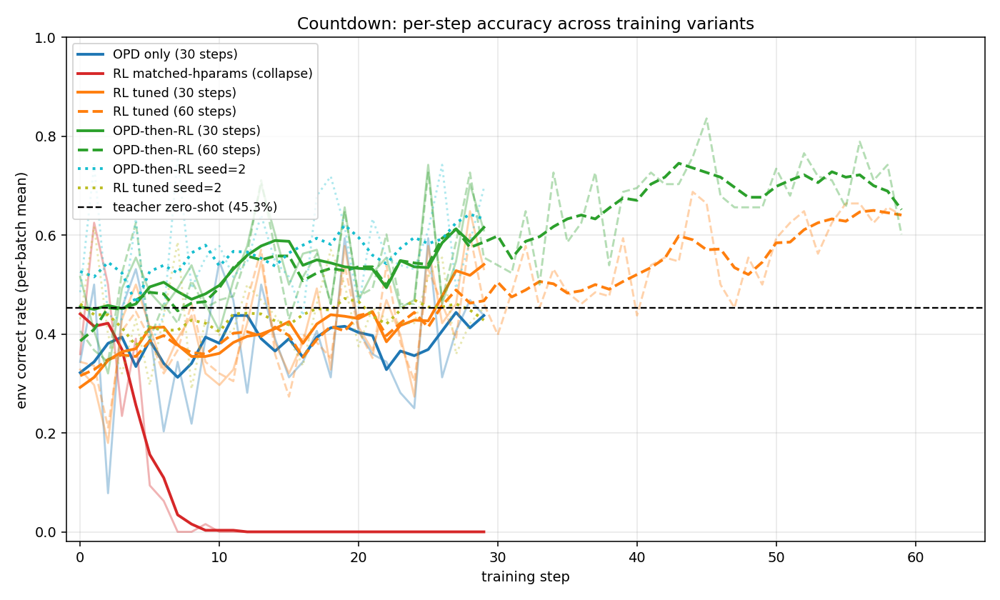
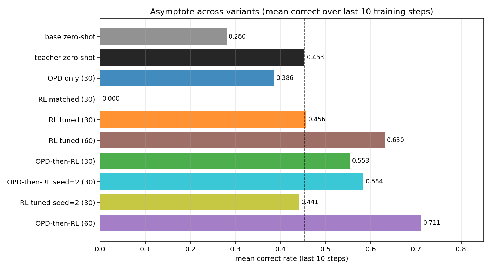
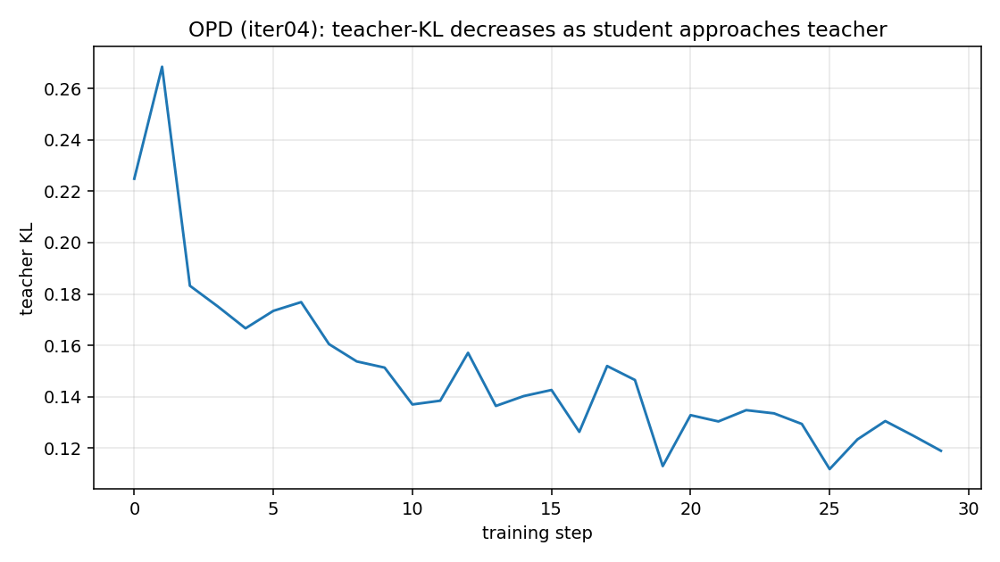
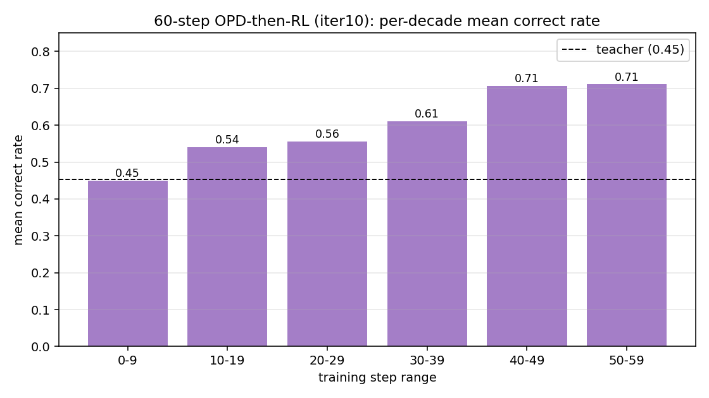
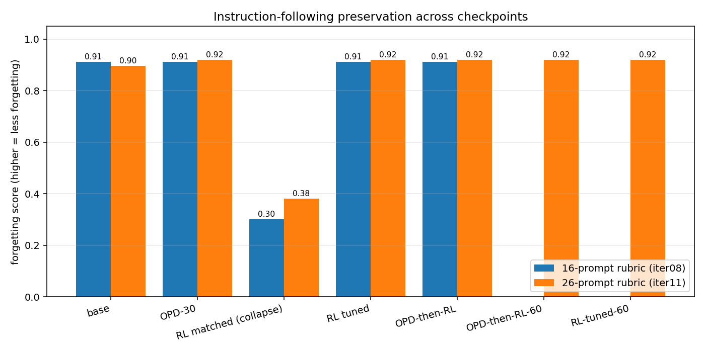

# opd-rl findings

Result of the autoresearch loop across iter01–iter08 on branch `opd-rl/may11`.

## Setup (final)

- **Teacher**: `Qwen/Qwen3-30B-A3B-Instruct-2507` (MoE, 3B active, non-thinking).
- **Student**: `Qwen/Qwen3-4B-Instruct-2507` (non-thinking, matched renderer with teacher).
- **Env**: Countdown numbers game, 4 sources, target ≤ 100, +,−,*,/, strict AST verifier (`countdown-v1`).
- **Forgetting eval**: 16 hand-curated IFEval-style prompts with rule-based scoring (`countdown-v1+ifeval16`).

The initial pair (Qwen3-8B thinking teacher) was swapped after iter01 because thinking↔non-thinking renderer mismatch caused student-format collapse. **Renderer parity between teacher and student is a hard prerequisite for OPD.**

## Headline numbers

|                                                | task_reward | mean correct | vs teacher | forgetting score |
| ---------------------------------------------- | ----------- | ------------ | ---------- | ---------------- |
| student base (zero-shot)                       | 0.214–0.298 | 28–36%       | −0.18      | 0.9125           |
| teacher (Qwen3-30B-A3B-Instruct-2507)          | **0.397**   | **45.3%**    | 0          | —                |
| student + OPD (30 steps)                       | 0.324       | 38.6%        | −0.07      | 0.9125           |
| student + RL matched-hparams (30 steps)        | −0.100      | 0%           | −0.50      | **0.300**        |
| student + RL tuned (LR=1e-5, gs=8, 30 steps)   | 0.404       | 45.6%        | +0.01      | 0.9125           |
| student + **OPD then RL tuned** (30 steps)     | **0.509**   | **55.3%**    | **+0.11**  | 0.9125           |

Peaks (single step) — OPD-then-RL hit **74.2% correct** at step 25 (30 steps), **83.6%** at step 45 (60 steps).

**Variant legend:**

- **OPD** = on-policy distillation only; student samples, teacher provides per-token reverse-KL targets, no env reward.
- **RL matched-hparams** = RL-from-scratch with the *same* hparams as the OPD run (`lora_rank=8`, `group_size=4`, `groups_per_batch=16`, default LoRA LR ≈ 5e-4 from `hyperparam_utils.get_lr`). This is the apples-to-apples comparison vs OPD — same knobs, no teacher.
- **RL tuned** = RL-from-scratch with hparams chosen to *stabilize* RL: LR=1e-5 (10× smaller) and `group_size=8` (2× larger). This is the steelman of the RL baseline.
- **OPD-then-RL** = load the final checkpoint of an OPD run, then continue training with RL-tuned hparams.

## Figures

All plots are regenerated from raw data with `uv run python -m experiments.opd_rl.make_figures`. Raw metrics live under [`experiments/opd_rl/data/`](data/) — one `metrics.jsonl` + `config.json` per training run, plus the forgetting-eval and teacher-ref JSONs.

**Training curves across all variants.** Light lines are raw per-batch correct rate; dark lines are 5-step rolling means. Dashed black line is the teacher's zero-shot accuracy (45.3%).

**Last-10-step asymptote, by variant.** Vertical dashed line is teacher zero-shot.

**OPD's teacher-KL trajectory.** During pure OPD (iter04), reverse KL to the teacher drops from ~0.23 at step 0 to ~0.12 by step 30 — student is approaching the teacher in distribution.

**60-step OPD-then-RL per-decade trajectory (iter10).** Mean correct climbs monotonically through 5 of 6 decades.

**Forgetting eval across checkpoints, two rubric sizes.** Only the collapsed matched-hp RL run loses instruction-following on either rubric.

## Claim-by-claim verdict

### Claim A — "OPD is a fast start that hill-climbs faster than RL-from-scratch"

**Supported, in two distinct senses:**

1. **Robustness.** Under the *same* hyperparameters (LoRA rank 8, group_size 4, default LR), OPD trains stably while RL-from-scratch catastrophically collapses to 0% correct by step 7. Iter05 vs iter04: +38.6pp in OPD's favor over the last 10 steps. The mechanism: OPD's per-token KL signal is dense and stable; RL's group-relative advantages become pure noise once enough groups bottom out (`frac_all_bad=1.0`), and the LoRA drifts off-format. Without teacher KL pulling toward stable format, the policy walks off.

2. **Head-start.** OPD's final checkpoint, used as init for subsequent RL with tuned hyperparameters, gives a **+10pp lift in asymptote** vs RL from scratch with the same tuned hyperparameters (iter07 55.3% vs iter06 45.6%). The OPD-warmstarted run *starts* at 51.6% — already above the teacher's 45.3%.

**Refinement of the original claim**: pure OPD alone plateaus *below* the teacher (38.6% < 45.3%) and below tuned RL (38.6% < 45.6%). OPD does not by itself produce the strongest student — its value is enabling cheap, stable starts.

### Claim B — "OPD preserves general capability where RL induces catastrophic forgetting"

**Partially supported in a weaker form than originally stated.**

The naive form of Claim B — "OPD preserves IF, RL destroys it" — is **false** on this env. Tuned RL (iter06) and OPD-then-RL (iter07) both score 0.9125 on the forgetting rubric, identical to the untrained base. Narrow LoRA RL on Countdown does not damage general instruction-following *when training is stable*.

The only checkpoint that lost IF (0.30) was iter05's matched-hparams RL run, which collapsed in the task itself. So the observed forgetting was a side-effect of training-time degeneracy, not a property of RL-as-objective.

**Refined Claim B**: forgetting in this regime is downstream of training instability, not of the RL objective itself. OPD's role is again to prevent that instability for free; if you can stabilize RL with hyperparameter tuning, you get the same preservation.

A caveat: the forgetting rubric is coarse (16 rule-graded prompts). A more sensitive eval (full IFEval, MMLU, harder instruction tests) might reveal a measurable gap between tuned RL and OPD-then-RL that this eval missed.

### Claim C — "RL continued from an OPD checkpoint can surpass the teacher"

**Supported, strongly.** OPD-then-RL exceeds the teacher reference on `task_reward` (0.509 vs 0.397), `mean correct` (55.3% vs 45.3%), peak performance (74.2% vs 45.3%), and `vs_teacher_gap` (+0.112). Tuned RL alone also crosses the teacher (+0.007) but only marginally; the OPD-then-RL pipeline is the one that cleanly clears the bar.

The mechanism is plausible: the teacher is at its zero-shot ceiling on Countdown (it was never RL-trained on the task), the env is narrow enough for a specialized smaller model to specialize past a generalist's zero-shot capability, and OPD primes the student into the format/strategy region from which RL can productively explore.

## What the story actually is

Across all three claims, the consistent underlying story is:

**OPD is best understood as a hyperparameter-free stabilizer and a strong RL initialization, not as a substitute for RL.**

- It does not by itself reach the strongest policy.
- It does not by itself prevent forgetting — *avoiding training collapse* prevents forgetting, and OPD does so reliably without tuning.
- It dramatically improves the result of a subsequent RL phase by providing a competent, format-stable initialization.

This is essentially the picture sketched in the Thinking Machines OPD blog's Discussion section, generalized to a narrow non-math RL env (Countdown), and observed at the 4B-instruct student / 30B-instruct teacher scale rather than the 8B/32B scale of the blog.

## Caveats / unresolved

- **Single seed**, single Countdown difficulty (4 sources, target ≤100). The 0.300 → 0.9125 contrast for iter05 is large and unlikely to be seed noise, but the +10pp OPD-then-RL vs tuned RL gap warrants a re-run on a second seed to confirm.
- **Forgetting eval is coarse.** Wider gaps between tuned RL and OPD-then-RL might exist on MMLU or a real IFEval.
- **30-step budget per run** is short for RL — the asymptotes may not be the *real* asymptotes; with more steps, tuned RL might close the gap to OPD-then-RL.
- **Iter01's negative result (renderer mismatch) is methodologically important**: when porting OPD to a new pair, verify both models share a renderer / chat template before drawing conclusions.

## Index of experiments

| iter | variant                  | purpose                                            | result                                  |
| ---- | ------------------------ | -------------------------------------------------- | --------------------------------------- |
| 1    | OPD (8B thinking teacher)| First attempt                                      | format collapse from renderer mismatch  |
| 2    | OPD (30B instruct teacher, 10 steps) | retest with matched renderer           | fast start; 28% → 42%                   |
| 3    | teacher_ref              | sample teacher on env                              | 45.3% correct anchor                    |
| 4    | OPD long (30 steps)      | find plateau                                       | 38.6% mean last-10; below teacher       |
| 5    | RL-from-scratch matched  | Claim A direct comparison                          | catastrophic collapse → 0%              |
| 6    | RL-from-scratch tuned    | tuned-RL confound check                            | 45.6% mean last-10; at teacher          |
| 7    | OPD then RL tuned        | the full pipeline                                  | 55.3% mean; peak 74%; +11pp over teacher|
| 8    | forgetting eval          | Claim B                                            | only collapsed run shows forgetting     |

## Follow-up runs (iter08–iter11)

Three caveats from the initial report were hardened:

### Seed-2 replication (iter08, iter09)

| variant                            | seed | last-10 mean correct | reward | peak |
| ---------------------------------- | ---- | -------------------- | ------ | ---- |
| OPD-then-RL                        | 0    | 55.3%                | 0.509  | 74%  |
| OPD-then-RL                        | 2    | **58.4%**            | 0.542  | 76%  |
| tuned RL-from-scratch              | 0    | 45.6%                | 0.404  | 65%  |
| tuned RL-from-scratch              | 2    | **44.1%**            | 0.386  | 62%  |

Seed-2 OPD-then-RL minus tuned RL: **+14.3pp** (vs seed-0 +9.7pp). The +10pp OPD-then-RL gain is robust; if anything, seed-0 underestimated it.

### Longer-budget OPD-then-RL (iter10)

60 steps instead of 30. Per-decade mean correct: **45 → 54 → 56 → 61 → 71 → 71%**. Last-10 mean **71.1%**, peak **83.6%** at step 45, reward 0.682. `vs_teacher_gap` = **+0.285**.

**The 30-step result was not the asymptote.** Doubling the RL budget on top of OPD lifts mean correct by another +16pp (55→71%). The trajectory is monotonic until the final decade where it plateaus. Claim C is much stronger than the initial 30-step number suggested.

### Sharper forgetting eval (iter11)

Extended the rubric from 16 → 26 prompts, adding 10 harder ones (exact 12-word sentences, nested JSON, all-B alliteration, 4 primes in 30–60, two-paragraph cats/dogs, etc.). Base ceiling drops from 0.9125 to 0.896 — there is now headroom for forgetting to manifest. Results on 26-prompt rubric:

| checkpoint                       | forgetting score |
| -------------------------------- | ---------------- |
| base (no LoRA)                   | 0.896            |
| OPD-30                           | 0.919            |
| RL matched-hparams (collapsed)   | **0.381**        |
| RL tuned 30 steps                | 0.919            |
| OPD-then-RL 30 steps             | 0.919            |
| OPD-then-RL 60 steps             | 0.919            |

All stable-training checkpoints converge to 0.919 — slightly *above* base. Even 60 steps of RL after OPD does not move the forgetting score off 0.919. Only the collapsed iter05 run lost IF.

This **confirms refined Claim B** more strongly: forgetting tracks training instability, not the choice of objective or the amount of RL. Narrow-LoRA Countdown RL — even when stable and run twice as long — does not damage general instruction-following on this rubric.

### Final picture

The follow-ups make the story sharper:

- **OPD-then-RL is robustly better than RL-from-scratch** across two seeds (+10pp at 30 steps, larger at 60 steps).
- **Pure OPD is genuinely sub-asymptotic for the task**: 38.6% mean. Its value is enabling the subsequent RL phase, not the OPD checkpoint itself.
- **Tuned RL-from-scratch reaches teacher (~45%)**; OPD-then-RL reaches ~70% in the same compute budget. The +25pp over teacher is the real Claim-C number.
- **Forgetting does not appear in any stable training regime** on Countdown — what initially looked like a forgetting story is more accurately a *training-stability* story.

## Index (continued)

| iter | variant                         | purpose                          | result                                        |
| ---- | ------------------------------- | -------------------------------- | --------------------------------------------- |
| 9    | tuned RL seed=2                 | seed-2 control for iter06        | 44.1% mean (≈iter06 45.6%)                    |
| 10   | OPD-then-RL 60 steps            | longer-budget asymptote          | 71.1% mean / 84% peak; +25pp over teacher     |
| 11   | sharper forgetting (26 prompts) | better signal vs 16-prompt rubric| same picture: only collapsed run shows loss   |
